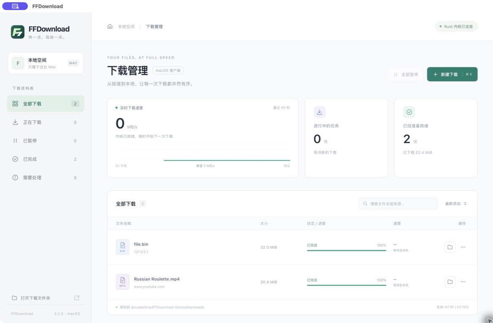

<p align="center"></p>

<h1 align="center">FFDownload</h1>

<p align="center">把下载，交还给你的电脑。一个以 Rust 为核心、支持 macOS 和 Windows 的开源下载管理器。</p>

<p align="center"><a href="https://ffdownloadmanager.vercel.app">产品官网</a> · <a href="https://github.com/gnipbao/FFDownloadManager/releases">下载安装包</a> · <a href="docs/macos-client.zh-CN.md">macOS 说明</a> · <a href="docs/windows-client.zh-CN.md">Windows 说明</a> · <a href="docs/download-engine-comparison.zh-CN.md">引擎调研</a></p>



## 能做什么

- **大文件下载**：HTTP/HTTPS、1–16 路连接、任务队列、实时速度与进度；服务器不支持 Range 时回退单连接。
- **暂停与续传**：保存分段状态，退出后重新打开可继续；下载完成前使用临时文件，避免把半成品当作最终文件。
- **视频解析**：使用 Rust 适配器解析 YouTube、B 站、抖音、小红书公开单视频，选择格式和清晰度；分离的音视频由内置 FFmpeg 无转码合并。视频号普通分享链接可通过一次性元宝 Cookie 解析，需自行验证可访问权限。YouTube、B 站、抖音、小红书已有实际下载样本。
- **本地管理**：下载文件和任务记录保存在本机，无需账号；可搜索、筛选并在系统文件管理器中定位文件。

界面由 Tauri 和系统 WebView 承载，下载任务直接调用 Rust 服务；项目还保留命令行和本地 Web 工作台。下载核心使用 `gosh-dl`、Tokio、reqwest。这里的“Rust 核心”指下载流程与视频编排；SQLite、TLS 等依赖包含其自身的原生实现。

## 安装

在 [Releases](https://github.com/gnipbao/FFDownloadManager/releases) 下载对应平台的安装包：

| 系统 | 构建目标 | 安装包 | 默认下载目录 |
| --- | --- | --- | --- |
| macOS 13+，Apple Silicon | `aarch64-apple-darwin` | DMG / ZIP | `~/Downloads/FFDownload` |
| Windows 10/11，x64 | `x86_64-pc-windows-msvc` | NSIS `.exe` | `%USERPROFILE%\Downloads\FFDownload` |

关闭 macOS 窗口时下载继续运行，点击 Dock 图标可恢复。Windows 关闭窗口时会最小化到任务栏。通过菜单或 ⌘Q / Ctrl+Q 退出时保存进度，再次打开后点击“继续下载”。两平台安装包均包含用于音视频合并的 FFmpeg 工具。当前预览版安装包未使用发布者证书签名或 Apple 公证，系统可能显示安全提示。

## 从源码构建

需要 [Rust 1.98.1](rust-toolchain.toml)、Node.js 22、npm，以及目标系统的原生开发环境。macOS 需要 Xcode Command Line Tools；Windows 需要 [Tauri 的 Windows 前置条件](https://v2.tauri.app/start/prerequisites/) 与 MSYS2 UCRT64（编译 FFmpeg）。

```sh
# macOS：生成 .app、DMG 和 ZIP 到 dist/
npm ci
sh scripts/build-macos.sh

# 命令行／本地 Web 工作台
cargo build --release --locked
./target/release/ffdm serve --port 17890
```

Windows 在 MSYS2 UCRT64 中先运行 `sh scripts/build-ffmpeg-windows.sh`，再在 PowerShell 中运行 `powershell -ExecutionPolicy Bypass -File scripts/build-windows.ps1`。NSIS 安装包生成在 `target/release/bundle/nsis/`。FFmpeg 源码版本和 SHA-256 固定在构建脚本中；对应源码与 LGPL 许可证会随安装包提供。

## 开发与验证

```sh
cargo fmt --all -- --check
cargo test --workspace --locked
cargo clippy --workspace --all-targets --locked -- -D warnings
```

GitHub Actions 在 macOS 与 Windows 各自的运行器上构建安装包，标签 `v*` 触发 Release 附件发布。网站是 `site/` 中的纯静态文件，由 [Vercel 配置](vercel.json) 部署；[上传清单](.vercelignore)仅包含网站素材。

目前主要覆盖单文件直链和公开视频。小红书遇到登录页时可手动提供本次解析所需的网页 Cookie；视频号普通分享链接需要元宝登录 Cookie。Cookie 只在本次解析请求中使用，不写入任务记录。视频号真实作品的下载与解密尚待样本验证。不支持浏览器接管、播放列表批量下载、直播录制或 HLS 清单分片；流媒体清单不是完整视频文件时会明确拒绝。高清测试结果、下载引擎对比与复现方法见 [视频封装验证](docs/video-parser-integration.zh-CN.md) 和 [测速记录](docs/mvp-benchmark.zh-CN.md)。

## 许可证

FFDownload 项目代码采用 [MIT License](LICENSE)。随包 FFmpeg 使用 LGPL 2.1 或更高版本，详见安装包内的 `third-party/`；Rust 与前端依赖遵循各自许可证。
