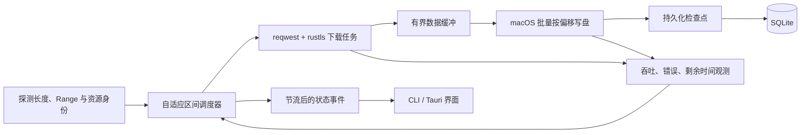

# Rust 下载引擎选型与性能方案

调研日期：2026-09-21。适用需求：macOS 优先，100–1000 Mbps 家庭／办公宽带，HTTP(S) 大文件、暂停与断点续传，产品体验参考 Neat Download Manager。

本轮核查了 8 个开源项目的仓库、依赖和关键源码，固定到文末所列提交。**本报告形成时没有编译或运行这些引擎，没有可用于排名的本机测速结果。** 后续已用 gosh-dl 构建 Rust MVP 并测试，见 [MVP 测速记录](mvp-benchmark.zh-CN.md)。下文仍为实现前的源码事实、性能推断和建议设计；仓库包含测试或 CI 配置不等于本轮已经验证通过。

**选型结论**

性能优先的主线建议是：**Rust + Tokio + reqwest/rustls，自己掌握自适应分段调度、写盘和恢复状态；复用成熟的 HTTP/TLS 实现。** 不需要从头实现网络协议，也不因为“更底层”就直接改用 Hyper。

若优先复用完整下载库，**gosh-dl 是本轮最值得先验证的 Rust 候选**，理由是嵌入接口、生命周期和持久化相对齐全，许可文件为 MIT；这不是“实测最快”的结论。性能候选再加入 libdl。tur-rs 值得研究慢分段拆分、连接调节和按站点记忆的设计，但其 macOS 写盘路径和快照持久化仍需验证。

将 gosh-dl 的任务、事件与恢复设计，以及 libdl、tur-rs 的调度思路作为参考；具体代码复用按各自许可处理。Aria2 Next、aria2、Gopeed 作为外部对照。最终选择复用哪一部分，由同一套正确性与性能测试决定。

这比宣称某个 Rust 库“世界最快”更符合现有证据：当客户端已能持续处理 125 MB/s，千兆环境中的主要差异往往来自服务器、线路、协议选择、连接调节和尾段耗时，而非语言名称。此处是基于带宽上限和代码结构的工程判断，尚未测得各候选的处理上限。

**开源引擎对比**

| 项目 | 核心语言／许可线索 | 核查到的主要特点 | 本项目中的定位 |
| --- | --- | --- | --- |
| [gosh-dl](https://github.com/goshitsarch-eng/gosh-dl) | Rust；MIT | Tokio/reqwest；分段、暂停恢复、事件、队列、SQLite；可关闭 BT 功能 | 完整 Rust 库的首选验证候选，需验证和优化下载数据路径 |
| [dl / libdl](https://github.com/gkpln3/dl) | Rust；LICENSE 为 MIT，Cargo 声明 MIT OR Apache-2.0 | 动态增减 worker、共享分段队列、1 MiB 写缓冲、显式启用 HTTP/2 | 轻量性能原型候选；响应校验与持久化边界需补强 |
| [tur-rs](https://github.com/greykaizen/tur-rs) | Rust；Cargo 声明 GPL-3.0-only | Hyper、动态调节、慢分段借用、实验性 H3/Linux I/O 后端 | 调度算法参考与对照候选；不能将 Linux 优化等同于 Mac 收益 |
| [KGet](https://github.com/davimf721/KGet) | Rust；MIT | 所查并行路径使用 reqwest blocking + Rayon，按偏移写入 | 不作为首选内核；先处理短写等正确性问题 |
| [Trauma](https://github.com/rgreinho/trauma) | Rust；MIT | 异步批量文件下载、重试与顺序续传 | 适合批量下载；所查路径不具备单文件动态分段调度 |
| [Aria2 Next](https://github.com/AnInsomniacy/aria2-next) | C/C++；GPL，源码含 2.0-or-later 声明 | libcurl multi、区间调度、尾段协助、失败后的连接预算调整 | Rayburst 实际使用的引擎；重点性能对照 |
| [aria2](https://github.com/aria2/aria2) | C++；GPL-2.0-or-later | 多协议、分段、恢复、RPC；所查 HTTP 请求实现为 HTTP/1.1 | 长期维护的基线，测试时必须明确设置并发参数 |
| [Gopeed](https://github.com/GopeedLab/gopeed) | Go；GPLv3 | 单文件分段、慢连接工作转移、按偏移写入，原生 transport 尝试 HTTP/2 | 另一种实现路线的对照，不能仅凭 Go 语言排除 |

许可线索来自对应仓库的 LICENSE/COPYING、源码头或 Cargo 声明；libdl 两处声明的差异需在实际引入时核对。维护信息采用固定提交日期，不以星数或 README 的速度宣传作排名。

Rayburst 是桌面应用；其下载内核 Aria2 Next 单独参与比较。用 Rust 应用层调用它可以快速做产品，但不能称为 Rust 下载内核。Aria2 Next 的官方说明明确列出 Rayburst 集成和 libcurl/libtorrent 等依赖。[Aria2 Next 说明](https://github.com/AnInsomniacy/aria2-next/blob/08428a3a54baa555da682c9af70d621411448fb1/README.md)。

**影响选型的源码发现**

1. **gosh-dl：完整性较好的候选，但当前写盘结构值得优化。** `init_segments` 按初始连接数量等分文件；所查下载路径共用 `Arc<Mutex<File>>`，每个收到的数据块都持锁执行 `seek` 和 `write_all`。这会让写盘串行，并引入频繁的异步文件操作。它是潜在优化点，不能据此断言千兆网络一定跑不满。[分段初始化](https://github.com/goshitsarch-eng/gosh-dl/blob/d1545fff36d3c1817716d790019c791bf54f74a7/src/http/segment.rs#L155)，[共享文件写入](https://github.com/goshitsarch-eng/gosh-dl/blob/d1545fff36d3c1817716d790019c791bf54f74a7/src/http/segment.rs#L576)。

   另一个容易漏掉的细节：其 reqwest 关闭默认 features，却未显式列入 `http2`。不能因采用 reqwest 就认定这个构建启用了 H2；应检查最终 Cargo feature 合并结果和实际协商协议。仓库的 CI 配置包含 macOS，但本次没有查询或运行对应 CI 结果。[Cargo 配置](https://github.com/goshitsarch-eng/gosh-dl/blob/d1545fff36d3c1817716d790019c791bf54f74a7/Cargo.toml#L28)，[reqwest feature 文档](https://docs.rs/reqwest/latest/reqwest/#optional-features)，[CI 配置](https://github.com/goshitsarch-eng/gosh-dl/blob/d1545fff36d3c1817716d790019c791bf54f74a7/.github/workflows/ci.yml)。

2. **libdl：调度和缓冲值得验证，协议校验不能省略。** 源码会按吞吐变化调整 worker，默认上限 32；worker 从共享队列领取分段，各自打开文件句柄，使用 1 MiB 缓冲写入。所查 `send_range_request` 检查 206 状态，后续检查数据长度，但该路径未检查 Content-Range 的起止位置，也未给分段请求附加 If-Range。同样长度的错误区间不能仅靠长度检查识别。[调度与写入实现](https://github.com/gkpln3/dl/blob/dfbb4e1784a39240706e0cbb42de7a14aae03c6d/libdl/src/http/mod.rs#L35)，[分段响应路径](https://github.com/gkpln3/dl/blob/dfbb4e1784a39240706e0cbb42de7a14aae03c6d/libdl/src/http/mod.rs#L690)。

3. **tur-rs：有真正的慢分段协助，但 Mac 路径仍有额外开销。** 调度器会识别速度明显低于中位数的工作区间，将剩余部分分配给空闲 worker。macOS 后端采用按偏移写入，不过每批先 `to_vec()` 复制，再克隆文件句柄并提交 `spawn_blocking`，且开启 `F_NOCACHE`。这些操作是否影响 100–1000 Mbps，需实测；Linux 的 splice/io_uring 不能作为 Mac 性能依据。[分段借用](https://github.com/greykaizen/tur-rs/blob/b759d19e1a102133a0f209bc8c565251bbe78257/src/engine/coordinator/borrowing.rs)，[macOS 后端](https://github.com/greykaizen/tur-rs/blob/b759d19e1a102133a0f209bc8c565251bbe78257/src/storage/macos.rs)。

   快照助手直接覆盖写入序列化文件，单看该函数没有原子替换或同步步骤；整个引擎的崩溃恢复顺序仍需进一步审查和故障测试。README 的性能表自述 WAN 下载耗时与 aria2/Axel 相当，本次未复现，不能据此认定最快。[持久化助手](https://github.com/greykaizen/tur-rs/blob/b759d19e1a102133a0f209bc8c565251bbe78257/src/engine/persistence.rs)，[项目自述基准](https://github.com/greykaizen/tur-rs/blob/b759d19e1a102133a0f209bc8c565251bbe78257/README.md#benchmarks)。

4. **Aria2 Next：支持 H2，不代表并行分段使用 H2。** 当前代码在 `ranged && maxConnections > 1` 时明确选择 HTTP/1.1，普通传输才使用可协商 H2 的设置。这是“多个请求”和“多条 TCP 连接”之间的重要区别。其调度器有区间领取、尾段协助和连接预算退让，值得作为性能基线。[协议选择](https://github.com/AnInsomniacy/aria2-next/blob/08428a3a54baa555da682c9af70d621411448fb1/src/stream/StreamRequest.cc#L197)，[调度器](https://github.com/AnInsomniacy/aria2-next/blob/08428a3a54baa555da682c9af70d621411448fb1/src/stream/StreamScheduling.cc)。

5. **KGet：先修正确性，再谈速度。** 所查并行写入调用 `write_at`/`seek_write` 后忽略返回的实际写入长度，直接按读取长度推进进度。底层允许短写，因此这一分支应循环写满或改用适当的完整写入封装。本次为源码发现，未触发实际短写故障。[KGet 写入代码](https://github.com/davimf721/KGet/blob/59c9f84351a22ed35dc1dea94866f39071a19c1c/src/advanced_download.rs#L765)，[Rust FileExt 语义](https://doc.rust-lang.org/std/os/unix/fs/trait.FileExt.html#tymethod.write_at)。

6. **Trauma 与 Gopeed 说明了两个不同方向。** Trauma 的 `buffer_unordered` 并发作用于文件列表，单文件恢复使用开放结尾的 Range；所查路径不是动态分段加速器。Gopeed 则有 `helpOtherConnection`，会把估计剩余时间较长的连接的一半工作转给空闲连接。对本项目而言，后者的调度思路更相关。[Trauma 文件并发](https://github.com/rgreinho/trauma/blob/0ce76ed08e99e9ad70799315d92e9746aa882061/src/downloader.rs#L121)，[Gopeed 工作转移](https://github.com/GopeedLab/gopeed/blob/694b43e3f93eedd654c32fa8fcf9ac4ea59a108a/internal/protocol/http/fetcher.go#L1981)。

上述检查覆盖关键路径，未覆盖每个引擎的全部协议、异常分支与依赖，不是完整代码审计。

**“理论上最快”应该优化什么**

近似吞吐上限：`min(可用下行带宽, 服务端总供给, 磁盘持续写入, 本机处理能力)`。100 Mbps 对应 12.5 MB/s，1000 Mbps 对应 125 MB/s，均未扣除协议开销。目标是接近当前条件下的可用吞吐，缩短完整文件完成时间。

| 场景 | 最有效的方向 | 预期边界 |
| --- | --- | --- |
| 单连接已占满下行 | 保持较低并发，降低额外请求和资源占用 | 增加连接没有带宽红利 |
| 单连接被限速，而服务器允许更高总吞吐 | 用多个真实连接并行 Range | 总速度仍受站点／账号／IP 总限制 |
| 延迟高、单流窗口不足 | 检查 TCP/H2 流控窗口、复用连接，比较多连接策略 | 并发 H2 stream 不等于多个 TCP 拥塞窗口 |
| 末尾只剩一个慢分段 | 按预计剩余时间拆分剩余区间，让空闲连接协助 | 分段过小会被请求开销抵消 |
| 下载途中断网、进程退出 | 精确保存可恢复区间，重试未完成数据 | 重复下载的字节也应计入效率损失 |
| 外置盘或其他任务争用磁盘 | 有界缓冲、批量写盘、网络背压 | 无限制加连接无法解决写盘瓶颈 |

例如 1 Gbps、50 ms RTT 的带宽时延积约为 6.25 MB，反映填满链路所需的在途数据量。它不是应用缓冲区的固定大小；TCP、H2 流控、并发连接与写盘队列必须分别分析。[TCP 窗口扩展规范](https://www.rfc-editor.org/rfc/rfc7323.html)，[HTTP/2 流控](https://www.rfc-editor.org/rfc/rfc9113.html#section-5.2)。

**建议的 Rust 内核结构**

以下为起始设计参数，必须通过实验校准，不是已证明的最优值。

| 模块 | 首版建议 |
| --- | --- |
| 协议层 | Tokio + reqwest + rustls，明确启用 HTTP/2；保留强制 H1/H2 的实验选项 |
| 连接调节 | 大文件先用 2 路，按收益尝试 4、8；单路已足够则回退到 1；16 路作为高级实验上限 |
| 并发预算 | 同站点的多个任务共享连接预算，同时设全局预算，避免每个文件独立扩张造成总吞吐下降 |
| 调节依据 | 用平滑后的有效吞吐、错误率、写盘积压判断，采样约 1–2 秒；连续观察，避免瞬时波动反复扩缩 |
| 分段队列 | 连接数量与区间数量分开管理；初始区间 4–16 MiB，再按每连接速度调节到约 1–4 秒工作量，初步限定 2–64 MiB |
| 尾段处理 | 剩余时间明显超过新增请求成本时拆分；以区间租约和代次防止旧 worker 越界写入或重复提交 |
| 写盘 | 单一 `.part` 文件，批量按偏移写入；由有界阻塞工作线程处理文件 I/O，比较 256 KiB–1 MiB 批量大小 |
| 缓冲 | 先用全局 32–64 MiB 的应用数据队列预算，队列满时停止继续读取；系统 socket 缓冲和 UI 内存另计 |
| 恢复 | 保存资源身份、区间和可靠提交位置；先完成文件数据同步，再发布对应持久化检查点 |
| 状态上报 | UI 每秒约 4 次汇总更新；文件字节只流经 Rust 内核 |

HTTP/1.1 多连接与 HTTP/2 多流应作为不同策略测试，并按站点和网络条件短期记忆有效选择。应用中的 8 个 worker 不保证对应 8 条 TCP 连接；reqwest 的 `pool_max_idle_per_host` 限制的是空闲池，不是活跃请求数量。并发请求预算需由调度器管理，真实连接数通过观测验证。[reqwest 连接池与 H2 配置](https://docs.rs/reqwest/latest/reqwest/struct.ClientBuilder.html)。

Tokio 官方文档说明普通文件操作使用阻塞工作线程，并建议合并操作；按偏移完整写入可用 Unix `FileExt::write_all_at`，避免多个任务争用共享游标。是否用一条还是少量写盘工作线程应以 Mac 实测决定，不能把“并行写盘越多越好”当作前提。[Tokio 文件 I/O](https://docs.rs/tokio/latest/tokio/fs/)，[按偏移完整写入](https://doc.rust-lang.org/std/os/unix/fs/trait.FileExt.html#method.write_all_at)。

首版优先使用正常缓存写入，把 `F_NOCACHE`、预分配策略作为后续对照项。`set_len` 不等于已完成物理空间预分配。Linux io_uring、splice 不能直接成为 macOS 的加速方案；HTTPS 的用户态解密也使“网卡到文件全程零拷贝”不能被轻易承诺。[Apple fcntl 接口](https://developer.apple.com/library/archive/documentation/System/Conceptual/ManPages_iPhoneOS/man2/fcntl.2.html)，[io-uring 平台说明](https://docs.rs/io-uring/latest/io_uring/)。

reqwest 是 HTTP 客户端组件，不负责分段、崩溃恢复或任务调度；Hyper 更底层但同样不是完整下载引擎。只有 profiling 证明客户端抽象或连接控制限制了目标场景，才考虑替换 transport。HTTP/3 在当前 reqwest 文档中仍标为实验性，首版不依赖它；后续按真实服务器覆盖和丢包实验决定。[reqwest 文档](https://docs.rs/reqwest/latest/reqwest/)，[Hyper 官方说明](https://hyper.rs/)。

**速度优化必须保留的正确性条件**

- 不能只相信 `Accept-Ranges`：实际检查探测响应；每段检查 206、Content-Range 起止和总长度、实际字节数。超长数据在写入目标区间之前拒绝。
- 原始文件下载使用 `Accept-Encoding: identity`，关闭透明解压，保持 Range 偏移与实际写入字节一致。
- 恢复时优先强 ETag；弱 ETag 不用于 If-Range。Last-Modified 必须满足可作为强校验信息的条件；没有可靠身份依据时保守重启，不能仅凭文件名和长度拼接。
- Range 请求意外返回 200、资源已变化或返回错误区间时，受控重启／降级，不能把完整响应写进某个分段。
- 完整处理短写、磁盘满、取消与写入交叉；区分已接收、已写入、已持久化三种进度。SQLite 保存了记录，不代表文件数据已经同步。
- 崩溃恢复测试与断电持久性测试分开；Mac 的文件同步策略要对应实际承诺。暂停时尽量提交完整检查点，异常退出仅信任已确认的部分。
- 镜像并行留到后续；跨 URL 的同长度或 ETag 文本相同不自动证明内容相同，应有可信资源标识或分块摘要。

这些条件直接关系到“下完后文件可用”和“恢复无需重下”的体验。[HTTP Range 与 If-Range 规范](https://www.rfc-editor.org/rfc/rfc9110.html#section-14)。

**测试方案：用结果决定最终复用哪个引擎**

先做能共用参数和统计口径的 CLI 测试入口。外部引擎只传控制命令，文件字节不经过 UI；不能把消除少量 RPC 调用当作吞吐提升来源。

| 维度 | 计划覆盖 |
| --- | --- |
| 对照对象 | gosh-dl、libdl、tur-rs、自研最小内核；外部 aria2、Aria2 Next、Gopeed；curl 单连接作为参照 |
| 客户端 | 同一台 Apple Silicon Mac、同一块 SSD、相同供电与网络；记录系统、芯片、构建版本和编译选项 |
| 服务端 | 独立受控服务器，资源供给能力高于目标速率；提供相同 HTTPS 文件和 Range 行为 |
| 带宽／时延 | 100、500、1000 Mbps；RTT 约 1、30、100 ms；另选少量丢包组合，先测代表场景再扩展 |
| 服务端行为 | 无限单连接速率、每连接限速但允许更高总吞吐、按客户端限制总吞吐、慢尾段、429/503 |
| 文件 | 不易压缩的 1 GiB、4 GiB 测试数据，预先生成并保存 SHA-256；更大文件留作恢复与长期稳定性测试 |
| 参数 | 1、2、4、8、16 路；H1/H2 分开记录，验证真实连接数与协商协议；不把 H2 stream 数算作 TCP 连接数 |
| 重复 | 代表场景至少 5 轮，工具顺序随机交错；记录缓存状态，避免单次峰值和固定运行顺序偏差 |
| 异常恢复 | 暂停继续、杀进程、断网重连、睡眠唤醒、ETag 变化、错误 Range、磁盘满；完成后核对摘要 |

公网 CDN 另做少量现实验证，记录重定向、实际边缘节点、时段和网络状态，不能用两个不同 CDN 链接给引擎排名。测试无需对所有维度做笛卡尔积；先用代表组合筛选候选，再扩展异常与极端场景。

主要指标是从任务开始到可用文件完成的总耗时、平均有效吞吐、尾段耗时、重复传输字节、恢复丢失进度和完整性。CPU、RSS、写盘等待、系统调用频率作为解释指标。网络接收完成、最终同步、最终摘要计算分项记录；各工具若同步语义不同，用测试框架统一最终完成口径，不能拿“只写入页缓存”与“已同步文件”直接比较。

建议验收门槛：

1. 所有纳入测试的正确性案例通过，任何高吞吐但文件错误的结果不计入性能胜出。
2. 受控无额外服务端限速场景，争取达到该链路可测得有效载荷上限的 90% 以上；不是要求达到标称物理带宽的 90%。
3. 代表场景完成时间中位数力争处于同轮最佳对照的 5%–10% 范围；对于差异小于波动的结果判为接近，不强行排名。
4. 单连接限速和慢尾段场景证明自适应确有收益；单连接已满速场景不因增加连接而明显退化。
5. 崩溃恢复允许损失最近未提交的数据，但不能信任未可靠保存的区间；正常暂停尽量消除额外重传。

**建议实现顺序**

先完成受控服务端、摘要校验与统一计时，再建立 gosh-dl/libdl 和外部引擎的基线。随后实现最小 Rust HTTP 内核，对比固定分段与自适应调度，再逐项加入尾段协助、批量写盘、可靠恢复。每项优化单独测量收益，通过后才接桌面 UI。

如果 gosh-dl 在目标 Mac 和宽带上已经达到验收标准，优先采用它并只补必要行为，减少自研范围；若关键数据路径限制了性能或恢复语义，则保留产品接口，把自研调度与写盘模块作为核心。此决定依据实测，不预设“全部重写一定更快”。

**固定的源码快照**

下表日期为所查默认分支提交时间（UTC），不是发行版本发布日期。可复核的文件 URL 和 SHA-256 记录在 `download-engine-source-manifest.json`。

| 仓库 | 提交 | 提交日期 |
| --- | --- | --- |
| goshitsarch-eng/gosh-dl | `d1545fff36d3c1817716d790019c791bf54f74a7` | 2026-09-05 |
| gkpln3/dl | `dfbb4e1784a39240706e0cbb42de7a14aae03c6d` | 2026-05-31 |
| greykaizen/tur-rs | `b759d19e1a102133a0f209bc8c565251bbe78257` | 2026-06-13 |
| davimf721/KGet | `59c9f84351a22ed35dc1dea94866f39071a19c1c` | 2026-05-25 |
| rgreinho/trauma | `0ce76ed08e99e9ad70799315d92e9746aa882061` | 2026-09-06 |
| AnInsomniacy/aria2-next | `08428a3a54baa555da682c9af70d621411448fb1` | 2026-09-17 |
| aria2/aria2 | `9e7273583f83e881e3ec067b523ba88724088d2f` | 2026-06-25 |
| GopeedLab/gopeed | `694b43e3f93eedd654c32fa8fcf9ac4ea59a108a` | 2026-09-19 |
