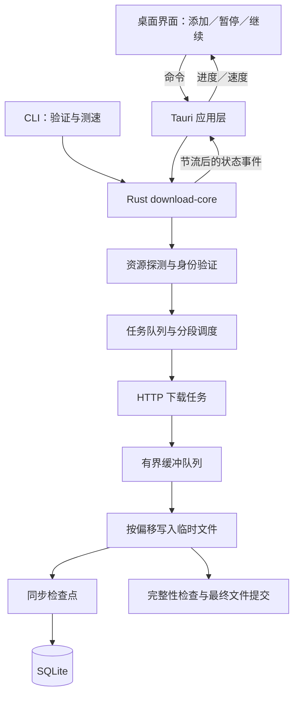

# FFDownloadManager：Rust 本地下载器调研与首版方案

调研日期：2026-09-21。以下为实现前的方案调研记录。后续已完成 Rust 命令行 MVP 和首轮本地测试，见 [MVP 测速记录](mvp-benchmark.zh-CN.md)。

已确认需求：macOS 优先；网络以 100–1000 Mbps 家庭／办公宽带为主；以大文件高速下载、暂停、断点续传为首版重点；参考 Neat Download Manager 的使用效果。调研开始时工程目录为空，本文件作为后续实现依据。

后续已完成 8 个开源下载引擎的源码选型调研，见 [Rust 下载引擎对比与性能方案](download-engine-comparison.zh-CN.md)。该补充报告细化了 gosh-dl、libdl、tur-rs、Aria2 Next 等候选及验证路径；目前仍无实测速度排名。

**建议采用独立 Rust 下载内核 + Tauri 2 桌面界面。** 内核负责网络、分段调度、写盘和任务恢复；界面只负责操作与展示。先用命令行验证速度和文件正确性，再接入桌面界面。Rust 适合高并发和资源控制，但最终速度需要用同源、同网络、同文件的对照实验确认。

本报告区分官方可确认的功能、建议设计和待验证指标。未安装或实测 Neat，没有其内部算法源码或性能数据；下文参数都是我们的初始设计，不代表 Neat 的实现。

**对标产品：需要复现哪些能力。**

Neat 官网说明其采用动态分段，支持暂停、崩溃后恢复、运行时调整连接数量与带宽，以及浏览器链接接管、链接更新和 HLS 分片合并。About 页说明两个桌面版本共用 C++ 下载引擎。可以借鉴“轻量界面 + 独立引擎”的结构；官网没有公开动态分段的具体策略。[Neat 功能说明](https://www.neatdownloadmanager.com/index.php/en/)，[Neat 引擎与浏览器集成说明](https://www.neatdownloadmanager.com/index.php/en/about)。

| 能力 | 我们的首版安排 | 用户可见结果 |
| --- | --- | --- |
| HTTP / HTTPS 大文件 | 必须 | 粘贴链接、选择目录、开始下载 |
| 动态分段与并发调节 | 必须 | 按服务器和网络表现调整下载方式 |
| 暂停、继续、重启恢复 | 必须 | 保留已确认写入的进度，避免重复下载整个文件 |
| 任务队列、分类、搜索 | 必须 | 下载中、已暂停、已完成、失败等视图 |
| 实时速度、剩余时间、分段状态 | 必须 | 任务列表简洁，详情面板可展开 |
| 限速、失败重试、代理 | 必须 | 全局与任务限速，系统／显式代理配置 |
| 链接过期后更换链接 | 首版做手动更新 | 验证资源身份一致后才沿用原有片段 |
| 浏览器接管 | 第二阶段 | Chrome / Edge 先做，Firefox 后续适配 |
| 网页视频、HLS | 后续独立模块 | 不占用首版大文件能力的开发资源 |
| FTP、复杂企业认证、BT | 后续按实际需求评估 | 不作为首版协议范围 |

**速度目标：提高有效吞吐，不承诺固定加速倍数。**

近似上限是：`实际速度 ≤ min(可用下行带宽，服务端可提供的吞吐，磁盘持续写入速度，本机处理能力)`。例如 1 Gbit/s 换算为 125 MB/s，是未扣除协议开销的理论值，不能直接当作软件必须达到的实际下载速度。

| 瓶颈 | 多分段可能的收益 | 设计策略 |
| --- | --- | --- |
| 单连接吞吐不足，服务器允许并发 | 有机会明显提速 | 逐级提高并发，检测真实增益 |
| 单连接已经跑满链路 | 增益很小，可能变慢 | 降低并发，减少额外请求 |
| 服务端按账号／IP 限制总吞吐 | 无法靠增加连接突破 | 保持稳定，尊重限流信号 |
| 高延迟或部分连接停滞 | 可能改善带宽利用与尾部耗时 | 调整分段大小，回收停滞任务 |
| 不支持 Range 或长度未知 | 无法按普通字节区间并行 | 顺序流式下载，明确恢复能力 |
| 外置盘、磁盘空间不足、写盘慢 | 网络并发可能适得其反 | 限制缓冲、向网络施加背压 |

产品中采用“自动优化”作为默认下载方式。高级设置提供并发上限；连接越多并不意味着一定越快。遇到 429 要降低压力，并按服务器提供的 Retry-After 等待。[HTTP 429 定义](https://www.rfc-editor.org/rfc/rfc6585.html#section-4)。

**技术路线比较与选择。**

| 方案 | 适合之处 | 需要承担的代价 | 判断 |
| --- | --- | --- | --- |
| Rust 自研内核 + Tauri 2 | 调度、恢复、限速策略可控；易做完整桌面产品 | 要认真处理 HTTP 边界与文件一致性 | 推荐主线 |
| Tauri + aria2c 子进程 | 快速得到较完整下载功能 | 下载核心不是 Rust，细粒度行为受外部引擎接口约束 | 作为备选及性能基线 |
| Rust + Iced | 界面和业务均可使用 Rust | 界面组件、平台交互及可访问性需要额外评估 | 有“界面也必须 Rust”要求时再选 |
| Rust 内核 + SwiftUI | 更适合深度 macOS 原生体验 | 增加 Swift/FFI 维护，Windows 界面另做 | 长期只做 Mac 时可考虑 |

aria2 提供分段、每服务器连接上限、续传与 RPC 等现成能力，适合做成熟对照；上游手册的许可文本为 GPL 第 2 版或更新版本，若将它纳入产品分发，需要另外检查其许可证与打包要求。本方案先将其用于独立测试工具。[aria2 仓库](https://github.com/aria2/aria2)，[aria2 参数与 RPC 手册](https://aria2.github.io/manual/en/html/aria2c.html)。

Rust 现有下载库 Trauma 已支持异步 HTTP(S)、重试、代理和续传；其公开功能说明未见对自适应分段、持久化检查点和桌面任务状态模型的明确覆盖，因此适合参考，暂不直接作为核心。[Trauma 项目](https://github.com/rgreinho/trauma)。

Tauri 的界面使用系统 WebView，macOS 上是 WKWebView；Rust 负责应用核心。这样不需要随应用携带一整套 Chromium，但体积和内存仍应实测，不能承诺复制 Neat 的安装包大小。本方案并非所有代码都用 Rust：UI 使用 React + TypeScript，下载数据流全部在 Rust 内。[Tauri 进程模型](https://tauri.app/concept/process-model/)。Iced 提供 Rust 跨平台 GUI，是纯 Rust 界面的备选。[Iced 官方仓库](https://github.com/iced-rs/iced)。

建议组件如下，具体小版本在实现时依据兼容性锁定并提交锁文件。

| 层 | 建议组件 | 职责 |
| --- | --- | --- |
| 下载运行时 | Rust + Tokio | 并发任务、取消、定时器、队列 |
| HTTP / TLS | reqwest + rustls | HTTP/1.1、HTTP/2、证书验证、连接复用 |
| 下载调度 | 自研 download-core | 区间分配、并发预算、重试、限速、状态机 |
| 数据写入 | Rust 文件接口 + 独立写盘工作线程 | 有界缓冲、按偏移写入、检查点同步 |
| 任务记录 | SQLite + rusqlite | 任务、分段进度、设置、数据库迁移 |
| 桌面 UI | Tauri 2 + React + TypeScript | 任务表格、详情面板、菜单栏、通知 |
| 完整性验证 | SHA-256 | 与发布方提供的可信摘要进行比对 |
| 诊断 | tracing + 本地轮转日志 | 记录阶段耗时、错误与调度变化，隐去敏感字段 |

reqwest 已提供 Tokio 异步客户端、连接池、代理、重定向及 TLS 支持；自研部分应聚焦下载策略，不重新实现 HTTP 或 TLS。其当前文档仍将 HTTP/3 标记为实验性，首版优先把 HTTP/1.1 和 HTTP/2 做稳。[reqwest 官方文档](https://docs.rs/reqwest/latest/reqwest/)。

**建议架构：UI 与文件数据流分离。**



界面不接收文件字节，只接收汇总状态；建议约每 250 ms 更新一次可见任务，暂停或完成等重要状态即时通知。关闭主窗口后下载可在菜单栏继续；显式退出应用会保存检查点并退出。首版无需另建常驻系统服务。

后续工程拆分建议：

```text
crates/download-core/   # 协议编排、调度、任务状态，独立于 GUI
crates/download-cli/    # 与桌面共用同一内核的调试和测速入口
crates/platform/        # 文件、睡眠唤醒等系统差异适配
apps/desktop/           # Tauri 应用与前端
tests/http-fixtures/    # 可注入异常的本地 HTTP 测试服务
benchmarks/             # 场景、参数、结果与重复实验脚本
docs/                   # 方案、设计决策和验收记录
```

以上仅为规划，没有创建实现骨架。

**高速内核：分段、自适应和写盘要一起设计。**

1. **先探测。** 用小范围 GET 验证服务器实际行为；HEAD 只作辅助。记录总长度、最终地址、资源验证器和内容编码。仅声明支持 Range 还不够，必须检查响应是否真的符合请求区间。[HTTP Range 规范](https://www.rfc-editor.org/rfc/rfc9110.html#section-14)。
2. **建立不重叠的区间队列。** 一个区间同时只能由一个有效任务拥有；区间记录已确认写入的位置。下载快的任务完成后继续领取剩余区间，避免一开始平均切成几块后长期等待最慢的一块。
3. **根据增益调整并发。** 小文件默认一个任务；大文件从两个并发任务起步，观察数秒后逐级尝试四个、八个。吞吐没有明显增长，或者出现限流、重试、磁盘积压时退回较低并发。收尾阶段根据剩余工作量缩减请求。
4. **必要时再处理慢尾段。** 首版先做共享区间队列与停滞重试；确认收益后增加未完成区间再拆分。回收时取消旧任务、等待写入完成并更新区间代次，避免旧任务继续写入已重新分配的范围。
5. **跨任务共享预算。** 同一服务器的三个下载任务不能各自无限增加并发；按源站及全局预算公平调度。根据实际重定向目的地重新计入预算。限速统一按接收字节计量，重试流量也计算在内。

HTTP/2 可以在一条连接上承载多个流，因此“八个分段请求”不等于“八条 TCP 连接”。默认允许协议协商，并通过受控测试比较 H2 多流与 H1 多连接；按源站采用有效策略，不默认强制 H1，也不把协议版本当作速度保证。[HTTP/2 规范](https://www.rfc-editor.org/rfc/rfc9113.html)。

连接数用应用层信号量控制；reqwest 的 `pool_max_idle_per_host` 控制的是空闲连接池大小，不能用它代替活动连接预算。分段请求固定字节表示，要求 identity 编码并关闭自动解压；如果服务器仍返回其他内容编码，退出分段路径，使用独立的顺序下载策略。读超时用于发现停滞，不给整个超大文件设置过短的固定总超时。[reqwest ClientBuilder](https://docs.rs/reqwest/latest/reqwest/struct.ClientBuilder.html)。

初始调参范围如下，全部需要基准测试后确定：

| 参数 | 建议起点 | 调整依据 |
| --- | --- | --- |
| 小文件阈值 | 16 MiB 以下默认顺序下载 | 探测／建连成本与文件耗时 |
| 单任务并发 | 从 2 起，自动尝试 4、8；高级上限 16 | 吞吐增益、限流、错误率、剩余数据 |
| 同源总并发 | 默认最多 8 个活动请求 | 多任务公平性与服务器反馈 |
| 全局并发 | 最多 24 个活动请求、3 个活动文件 | 内存、网络和磁盘表现 |
| 分段请求大小 | 8–64 MiB 作为测试范围 | 每段耗时、延迟与重试浪费 |
| 写盘批次 | 256 KiB–1 MiB 作为测试范围 | 系统调用成本与暂停延迟 |
| 下载数据缓冲 | 全局预算先设 64 MiB | 按字节限额，含排队及在途写入缓冲 |
| 吞吐采样 | 约 1 秒采样、3–5 秒再评估 | 平滑波动，避免频繁升降并发 |
| 检查点 | 约 1–2 秒汇总，暂停／退出时强制检查点 | 重下载量与同步开销 |

有效并发取单任务、同源和全局预算中最紧的限制；需要超过默认同源八个时，必须相应修改高级设置。这些数值不用于对外宣称“最佳线程数”。

写盘建议直接写同一目录下的任务专属临时文件，例如 `filename.<task-id>.part`。Rust Unix `FileExt::write_all_at` 可以按偏移写入，不依赖共享文件游标；调度层仍需保证区间互斥。避免将不同线程的 `seek + write` 混用在同一游标上。[Rust FileExt](https://doc.rust-lang.org/std/os/unix/fs/trait.FileExt.html)。

采用持续运行的写盘工作线程和有界队列，按批次写入；磁盘处理不及时时暂停上游读取。Tokio 文件 I/O 通常依赖阻塞线程池，官方建议减少碎片化操作；不能把每个小网络包都转换成一次独立阻塞任务。[Tokio 文件 I/O](https://docs.rs/tokio/latest/tokio/fs/index.html)。

提前检查可用空间；设置逻辑文件长度并不代表已经预留实际磁盘空间，写入过程中仍要处理空间耗尽。单临时文件完成后不需要再把所有片段复制合并一遍，可减少额外 I/O 与双份空间需求。

**断点续传：先保证文件正确，再优化恢复速度。**

建议状态机包含：排队、探测、下载、暂停中、已暂停、等待重试、等待用户、校验、最终提交、完成、失败、已取消。UI 请求暂停后进入“暂停中”，只有停止新请求、处理在途写入并保存检查点成功后才显示“已暂停”。

数据库保存资源验证器、长度、区间、已持久化偏移、临时路径、任务状态和错误类别。敏感请求头采用单独凭据引用，不写入普通日志。

1. 数据先写入临时文件；网络已收到的字节不直接记为持久化进度。
2. 写盘队列建立检查点屏障，同步已完成写入，再通过 SQLite 事务提交对应区间的进度。
3. 进程异常结束后，从最近有效检查点恢复；未确认部分允许重下载，不能仅看临时文件长度判断完成。
4. 完成前检查区间覆盖与总长度。有可信 SHA-256 时做比对；没有可信参考值时，自行计算一个哈希不能证明文件与原始发布内容一致。
5. 保留“最终提交”中间状态，同目录提交为最终文件并防止覆盖已有文件；对提交前后发生的崩溃做启动对账，再标记完成。

Rust 的文件同步与 SQLite 的事务是两个独立持久化步骤。SQLite 建议先采用 WAL + FULL 同步模式；SQLite 不会替下载内容文件提供事务保障。macOS 的更强同步策略和真实掉电恢复需单独验证；本阶段主要验收进程崩溃、应用重启与正常系统重启。[Rust File 同步接口](https://doc.rust-lang.org/std/fs/struct.File.html#method.sync_all)，[SQLite WAL](https://www.sqlite.org/wal.html)，[SQLite 同步选项](https://www.sqlite.org/pragma.html#pragma_synchronous)。

恢复请求使用可靠的资源验证器。优先强 ETag；只有满足规范强验证条件的 Last-Modified 才可作为替代。弱 ETag 不用于 If-Range。收到完整响应、区间不符或资源变化时，旧片段不与新内容拼接。[If-Range 规范](https://www.rfc-editor.org/rfc/rfc9110.html#section-13.1.5)。

我们的保守策略是：没有可靠验证器时默认顺序下载，并明确说明无法可靠跨会话续传；不能仅凭文件名、长度相同就继续拼接。更换过期 URL 时，跨地址 ETag 字符串一致也不能直接证明身份；需可证明的稳定资源标识或可信摘要，否则创建全新下载并保留原有未完成任务供用户处理。

首版必须有以下异常覆盖：

| 场景 | 预期行为 |
| --- | --- |
| 忽略 Range，返回整个文件 | 丢弃当前分段响应，重建顺序下载流程 |
| 错误区间、长度异常、响应中断 | 不提交错误区间；安全重试或失败 |
| 空文件、未知长度、极大文件 | 分别处理，不产生除零或整数溢出 |
| 文件在下载过程中被替换 | 停止混合写入，明确提示资源变化 |
| 网络断开、睡眠唤醒 | 重建请求并验证资源，从检查点继续 |
| 429／503 | 退避，遵循适用的 Retry-After；限制总重试次数 |
| 401／403、签名 URL 过期 | 等待更新凭据或链接，不无限重试 |
| 无空间、外置盘移除、无写入权限 | 保留任务记录与已保存片段，解释可恢复原因 |
| 快速连续暂停／继续 | 状态转换串行化，旧任务不能继续改写文件 |
| 正在完成时进程被结束 | 启动后对账临时文件、最终文件和数据库状态 |

**桌面体验：围绕大文件下载组织界面。**

建议主窗口采用三部分布局：左侧任务分类；中间任务表格；右侧可收起的详情。默认展示文件名、进度、速度、剩余时间和操作按钮。详情页提供速度曲线、来源、保存位置、重试原因和分段进度。

新建下载只需链接与保存位置；文件名、大小、是否支持续传由探测后展示。并发数、请求头、代理、校验和放入高级设置。预计剩余时间在速度稳定后显示，未知长度时不显示虚假百分比。

macOS 首版包括菜单栏入口、关闭窗口继续下载、完成通知、在 Finder 中显示、拖入 URL 文本和常用快捷键。建议首个验收环境为 Apple Silicon + macOS 13 或更高版本；这是产品支持范围建议，并非 Tauri 的最低系统要求。Intel 构建可随后验证，必须有真实环境验证后才标记支持。

显式退出时保存进度；系统进入睡眠时下载暂停，唤醒后恢复。若后续提供“下载时保持唤醒”，做成明确开关，并按电源状态处理。

应用只加载自身界面资源，文件操作由 Rust 校验保存位置、文件名与覆盖策略；重定向到其他来源时不盲目转发 Authorization 或 Cookie。来源 URL 可能含临时签名，日志需过滤查询参数。下载记录与设置保存在本地，无需服务端账户。[Tauri 权限能力模型](https://tauri.app/security/capabilities/)。

本机开发验证与公开分发分开安排。对外发放 macOS 安装包时，将 Developer ID 签名与公证纳入发布流程；正式发布依赖相应 Apple 开发者账户和凭据。[Tauri macOS 签名与公证](https://tauri.app/distribute/sign/macos/)。

**浏览器接管：预留入口，第二阶段实施。**

推荐路径是 Chrome / Edge 扩展 → Native Messaging → Rust 本地桥接程序 → 正在运行的下载应用。消息只发送链接和获准的必要请求上下文；下载在应用里完成。桥接程序限定扩展来源，并通过本地进程通信关联已启动的应用。[Chrome Native Messaging](https://developer.chrome.com/docs/extensions/develop/concepts/native-messaging)。

先做“右键使用 FFDownloadManager 下载”，再考虑可选自动接管。自动接管通过下载事件识别任务；应用确认能接收并可重放请求后，才取消浏览器原任务。无法重放的 POST、blob、一次性链接或需要特殊登录上下文的请求保留给浏览器。Chrome Manifest V3 对常规扩展的阻塞 webRequest 权限有限制，不能按旧版扩展方式设计“拦截所有下载”。[Chrome Downloads API](https://developer.chrome.com/docs/extensions/reference/api/downloads)，[Chrome webRequest 与 MV3 限制](https://developer.chrome.com/docs/extensions/reference/api/webRequest)。

媒体解析、站点适配、DRM 媒体及 Safari 集成均不在本次首版范围。HLS 后续作为独立任务类型接入，复用队列、重试与任务管理。

**验收：用可复现数据决定是否达到“高速”。**

本轮没有测速结果。下面是待实现的测试方法与候选门槛，不能当作已达到的性能指标。

对照工具采用 curl 单连接、合理配置的 aria2 多连接，以及可运行的 Neat macOS 版本。aria2 必须显式设置分段与每服务器连接上限，不能用默认单服务器连接配置作不公平对照。[aria2 连接与分段参数](https://aria2.github.io/manual/en/html/aria2c.html#cmdoption-x)。

| 测试维度 | 场景 | 核心判据 |
| --- | --- | --- |
| 速度基线 | 同源 1 GiB、10 GiB 文件，正常网络 | 完成耗时、有效吞吐、请求数量 |
| 并发收益 | 可控服务端限制单连接吞吐，但允许并发 | 随并发增加逼近实际链路上限 |
| 并发无收益 | 限制服务端总吞吐 | 自动收缩，不持续增加连接 |
| 协议差异 | HTTP/1.1、HTTP/2；不同延迟与丢包 | 按实际吞吐选择策略 |
| 续传正确性 | 分别在 10%、50%、90% 暂停／结束进程 | 最终 SHA-256 与测试源完全一致 |
| 协议异常 | 忽略 Range、错误区间、ETag 变化、短响应 | 不将错误文件标记为完成 |
| 系统异常 | 断网、睡眠、盘满、外置盘消失 | 明确状态，恢复后文件正确 |
| 资源控制 | 1／3 个大文件与较大任务列表 | 缓冲有界、UI 响应稳定、CPU 可解释 |

每组至少重复三次，按交错顺序运行对照工具，保持服务器、代理、协议、存储和文件一致；工具之间不同时抢占带宽。记录冷／热缓存、工具版本、网络条件和磁盘状态。报告中位数与范围，保留失败案例。较小样本不做缺乏依据的尾延迟分位数宣传。

测速区分网络阶段耗时与“文件最终可用”的端到端耗时，后者包含必要的写盘同步和校验；工具间校验与同步策略应尽量保持一致，无法对齐的差异单列说明，不把差异算作纯下载速度收益。统一单位，分别报告有效文件字节与包含重试的网络接收量。内存统计同时包含 Rust 和 WebView 进程，并记录 CPU 与磁盘吞吐。

候选验收门槛：

- 在受控、支持分段、源站容量充足的场景中，吞吐达到同条件实测可用带宽的 90% 以上；可用带宽指受控实验基线，不是宽带套餐标称值。
- 与合理配置的 aria2 比较，稳定场景中位完成耗时目标不超过其 110%；若未达到，先定位网络、协议、校验或写盘差异，再决定优化路线。
- 全部确定性正确性测试通过，错误状态不会被标记完成；无参考摘要时只承诺协议与本地一致性检查，不宣称验证发布内容。
- 进程崩溃后允许重下最后一段尚未确认的数据；已确认区间可恢复且最终内容正确。
- 用户操作收到反馈目标小于 100 ms；实际暂停完成时间另外测量，不承诺网络取消与同步瞬间完成。
- 全局文件数据缓冲遵守设置上限；完整进程内存包括协议栈、TLS、数据库和 WebView，建立基线后再制定总内存门槛。

**实施顺序与交付物。**

以下为熟悉 Rust 和桌面开发的一名工程师的粗估，不是工期承诺；具体按首个实验结果修订。

| 阶段 | 交付 | 进入下一阶段的条件 | 粗估 |
| --- | --- | --- | --- |
| M0：可测内核 | CLI、流式下载、固定并发、源文件哈希对照 | 单连接／多连接结果正确，有可复现基线 | 2–3 工作日 |
| M1：可靠续传 | 状态机、持久化检查点、异常恢复测试 | 暂停、结束进程、资源变化等测试通过 | 5–8 工作日 |
| M2：性能优化 | 自适应并发、共享区间队列、写盘优化、对照报告 | 展示在哪些条件下提速、哪些条件下回退 | 4–6 工作日 |
| M3：Mac 应用 | 桌面界面、菜单栏、通知、唤醒恢复、安装包 | 真机端到端验收，分发条件齐备 | 4–6 工作日 |

基础图形布局可以在内核接口稳定后穿插推进；按上述顺序，总体约 15–23 工作日，即 3–5 周。浏览器扩展、媒体下载、Windows 发行和商店审核另行估算。早期可运行原型不等同于达到上述恢复与性能验收的首版。

推荐最先实现的具体切片：**同一大文件，完成顺序下载与四路分段下载，验证文件哈希；随后在下载中结束进程并恢复，再次验证哈希。** 这个切片能同时验证技术路线、速度收益和恢复设计，决定后续桌面产品开发是否具备扎实基础。
