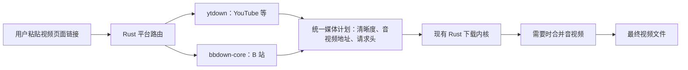

# Rust 视频解析库选型

核查日期：2026-09-21。目标：在现有 Rust 下载器中增加视频页面解析，优先 YouTube、B 站，并保留 macOS 桌面打包能力。

选型阶段检查了官方仓库、crates.io 实时版本元数据及发布源码。后续已按选型完成 `ytdown 0.8.0 + bbdown-core 0.5.0` 的编译和接入，并对 YouTube、B 站各一个公开样本完成解析、下载与合并验证，见 [实施记录](video-parser-integration.zh-CN.md)。表中其他候选未进行真实平台测试；“实现了某个平台”不等于该平台当前所有链接均可下载。

## 建议

采用 **ytdown 0.8.0 + bbdown-core 0.5.0**：前者处理 YouTube 和部分其他平台，后者处理 B 站。二者都提供可嵌入的 Rust 接口，只调用解析功能，把媒体字节交给现有下载内核。

这是基于接口、依赖及发布情况的选型，不是速度或成功率排名。两者项目均较新，已通过单样本验证，仍需持续扩大平台样本覆盖。

## 候选比较

| 项目 | crates.io 最新稳定版／发布日期 | 已核查能力与依赖 | 对本项目的判断 |
| --- | --- | --- | --- |
| [ytdown](https://github.com/4thel00z/ytdown) | 0.8.0／2026-08-05 | 原生 Rust extractor；默认注册 YouTube、Reddit、TikTok、Instagram、X/Twitter；内嵌 Boa JS 引擎；MIT OR Apache-2.0 | 首选验证候选；未发现 B 站内置适配器；体积和 RSS 待测 |
| [bbdown-core](https://github.com/Joey-Project/BBDown-rust) | 0.5.0／2026-06-20 | B 站及国际版解析；提供下载计划、音视频地址、请求头和格式信息；MIT | B 站首选验证候选；可使用解析接口，不必采用它的下载实现 |
| [tydle](https://github.com/Dev-Siri/tydle) | 0.1.15／2026-04-09 | 专注 YouTube；模块化元数据、流及签名解析；MIT；原生 `cipher` feature 引入 `deno_core` | 功能范围精简，但启用完整签名能力后包含 Deno/V8，不能据源码包小认定最终产品更轻 |
| [RustyPipe](https://codeberg.org/ThetaDev/rustypipe) | 0.11.4／2025-04-23 | YouTube／YouTube Music；内嵌 QuickJS；Web 客户端 PO token 流程调用额外的 rustypipe-botguard；当前主分支 Cargo 声明 GPL-3.0-only | 功能较全，可作兼容性对照；完整部署涉及更多组件 |
| [rusty_ytdl](https://github.com/Mithronn/rusty_ytdl) | 0.7.4／2024-08-10 | 原生 YouTube 解析、搜索与下载，包含 Boa；已有发布版本 403 报告 | 暂不作为首选，需要先确认发布版与仓库修复的差异 |
| [rustube](https://github.com/DzenanJupic/rustube)／[ytextract](https://docs.rs/ytextract/0.11.2/ytextract/) | 0.6.0／2022-10-16；0.11.2／2023-01-29 | 原生 YouTube 库，发布年代较早；ytextract 所列上游仓库本轮返回 404 | 暂不作为新产品首选 |

发布日期来自 [crates.io API](https://crates.io/data-access)。发布日期不等于仓库最后维护日期：例如 RustyPipe 主分支在 2026-08-03 仍有许可证标识更新，但这不能证明视频解析已经适配当前站点。

## 源码核查要点

- **ytdown 0.8.0**：发布包中的 `src/extractor/` 确有五个平台的实现；`src/jsi.rs` 使用 `boa_engine::{Context, Source}` 执行签名函数。所查解析路径未调用 yt-dlp 或 Python。音视频合并位于可选 `ffmpeg` feature 下。README 明确说明真实 YouTube 网络测试默认被忽略，因此不能把普通 CI 通过作为当前平台可用性的证据。[仓库说明](https://github.com/4thel00z/ytdown)、[发布 API 文档](https://docs.rs/ytdown/0.8.0/ytdown/)。
- **bbdown-core 0.5.0**：`src/client.rs` 提供 `plan_download`、`plan_download_with_mode`、`plan_playback`；`src/playback.rs` 定义类型化的播放计划。文档说明计划可包含主备地址、媒体请求头、编码及大小，适合作为现有内核的输入。FFmpeg 用于选用的封装步骤，解析本身不需要 Python。[发布包说明](https://docs.rs/crate/bbdown-core/0.5.0/source/README.md)。
- **tydle 0.1.15**：`Cargo.toml.orig` 的 `cipher = ["dep:deno_core"]`；`src/cipher/js.rs` 创建 `deno_core::JsRuntime` 并执行脚本。这里是**内嵌 Deno/V8**，不能误写为必须启动外部 Deno 命令，也不能归类为无 JS 运行时依赖。[发布源码](https://docs.rs/crate/tydle/0.1.15/source/)、[签名解析说明](https://github.com/Dev-Siri/tydle#signature-deciphering)。
- **RustyPipe**：`rquickjs` 是其正常依赖；官方说明 Web 客户端的 PO token 生成由单独的 rustypipe-botguard 程序处理。[依赖及 PO token 说明](https://docs.rs/crate/rustypipe/0.11.4)。
- **rusty_ytdl**：上游 issue #53 报告 crates.io 版本下载返回 403，并指出相关修复未发布。这是风险线索，不代表本轮实测所有视频均失败。[上游问题](https://github.com/Mithronn/rusty_ytdl/issues/53)。

[boul2gom/yt-dlp](https://github.com/boul2gom/yt-dlp) 虽然是 Rust crate，但解析实际调用 yt-dlp 命令行。它属于 Rust 封装，不属于原生 Rust 平台解析器。

## 集成方式

解析发生在本地 Rust 服务内，Web UI 负责展示清晰度和创建任务。以后改为 macOS 桌面端可以复用相同接口。

需要同时保存视频页面地址、媒体格式标识和解析时间，以便媒体地址失效后重新解析；恢复前仍需确认内容身份，不能直接把新地址拼到旧文件。请求头必须随媒体计划传给下载器，尤其是 B 站 Referer 等信息。

音频和视频可能分离，不能只下载视频轨后把它显示为完整视频。MVP 可使用 FFmpeg 做不重新编码的合并；若后续要求依赖也全部使用 Rust，再单独评估容器封装组件。当前内核面向 HTTP 文件，HLS/DASH 清单和分片流需要独立处理，不能把清单当成普通视频文件下载。

## 验证标准

1. 同一台 Mac、同一网络、同一组公开样本：YouTube 普通视频与 Shorts，B 站普通视频、分 P 和 b23 短链；其他平台分别验证。
2. 分开记录解析成功、媒体地址可读、音视频齐全和最终文件可播放，避免用“拿到标题”代替成功。
3. 记录冷启动／缓存命中解析耗时、峰值 RSS、release 成品体积及额外打包组件大小。
4. 检查地址过期重新解析、请求头传递、暂停恢复以及分离音视频合并。
5. 下载速度比较固定格式和媒体源，单独统计解析时间与传输时间。Rust 解析器可减少外部进程开销，但不能仅凭语言推断 CDN 吞吐更高。

此前已有的 yt-dlp 元数据基线在当前机器对 `jNQXAC9IVRw` 返回了标题和 11 个格式；该测试没有下载视频，也未验证这些媒体地址都可读取。它只作为后续 Rust 候选的解析对照。
